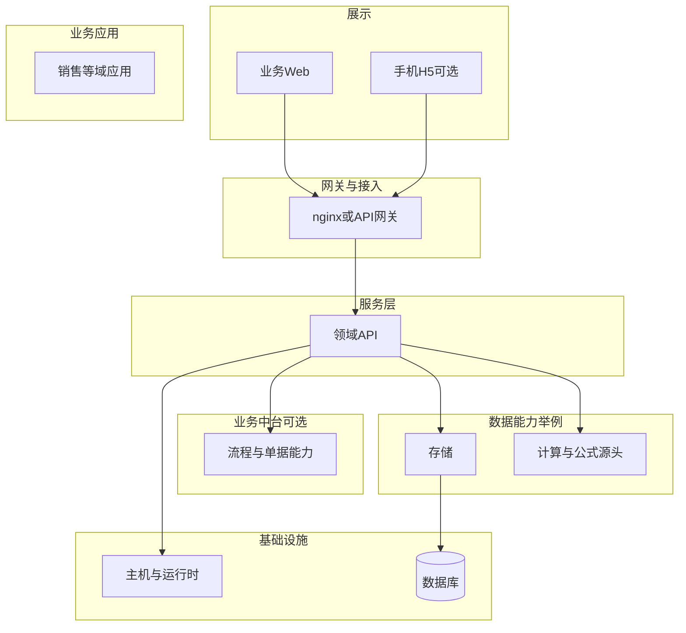

# 00 全站拓扑（可选附图）

> 非九幅必出核；当项目存在明确中台/网关/多应用时增补，并在索引登记。节点按**实际**命名，禁止空话层。

```mermaid
flowchart TB
  subgraph present [展示]
    Web[业务Web]
    Mobile[手机H5可选]
  end
  subgraph apps [业务应用]
    SalesApp[销售等域应用]
  end
  subgraph gateway [网关与接入]
    Nginx[nginx或API网关]
  end
  subgraph svc [服务层]
    API[领域API]
  end
  subgraph bizMid [业务中台可选]
    Flow[流程与单据能力]
  end
  subgraph dataMid [数据能力举例]
    Store[存储]
    Compute[计算与公式源头]
  end
  subgraph infra [基础设施]
    Host[主机与运行时]
    DB[(数据库)]
  end
  Web --> Nginx
  Mobile --> Nginx
  Nginx --> API
  API --> Flow
  API --> Store
  API --> Compute
  Store --> DB
  API --> Host
```

说明：层名可按项目增删（源数据、传输、治理…）；与 02 容器图、05 数据域、09 业务链保持一致，勿三套真相。
