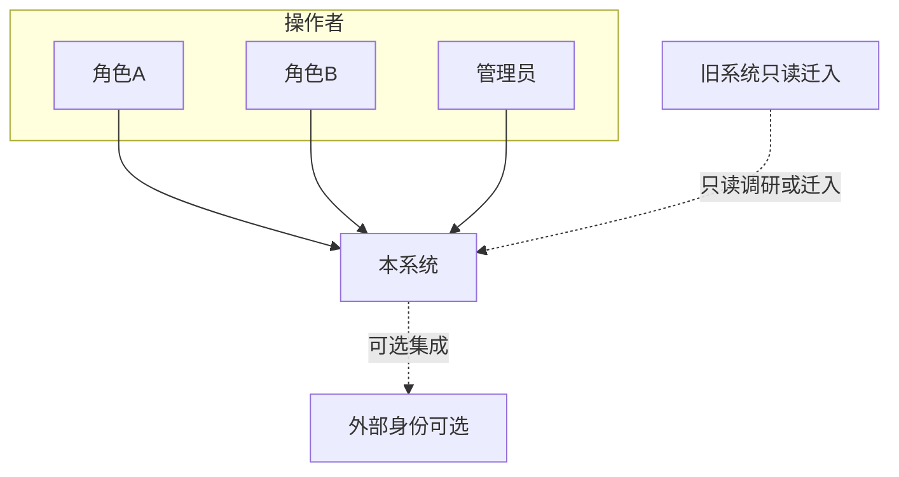

# 01 系统上下文

{{PROJECT_NAME}} — 谁在用、外围系统。

```mermaid
flowchart TB
  subgraph actors [操作者]
    RoleA[角色A]
    RoleB[角色B]
    RoleAdmin[管理员]
  end
  System[本系统]
  ExtIdP[外部身份可选]
  Legacy[旧系统只读迁入]
  RoleA --> System
  RoleB --> System
  RoleAdmin --> System
  System -.->|可选集成| ExtIdP
  Legacy -.->|只读调研或迁入| System
```

生成后：把节点标签改成**真实角色/系统名**；删掉用不到的外围。  
说明：{{CONTEXT_NOTES}}
