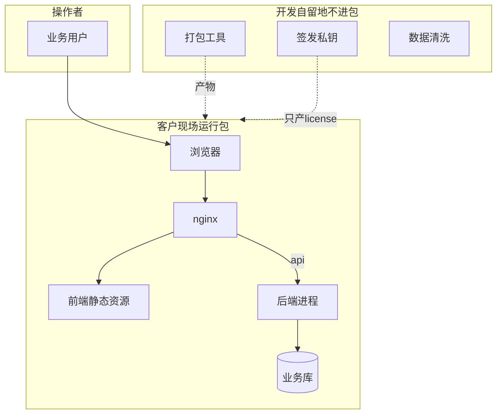

# 02 容器（运行时边界）

```mermaid
flowchart TB
  subgraph actors [操作者]
    User[业务用户]
  end
  subgraph runtime [客户现场运行包]
    Browser[浏览器]
    Nginx[nginx]
    Web[前端静态资源]
    API[后端进程]
    DB[(业务库)]
    Browser --> Nginx
    Nginx --> Web
    Nginx -->|api| API
    API --> DB
  end
  subgraph adminZone [开发自留地不进包]
    Pack[打包工具]
    CaKey[签发私钥]
    ETL[数据清洗]
  end
  User --> Browser
  Pack -.->|产物| runtime
  CaKey -.->|只产license| runtime
```

生成后替换节点为真实产物名/进程名/库名。  
硬约束：{{ADMIN_BOUNDARY_NOTE}}
