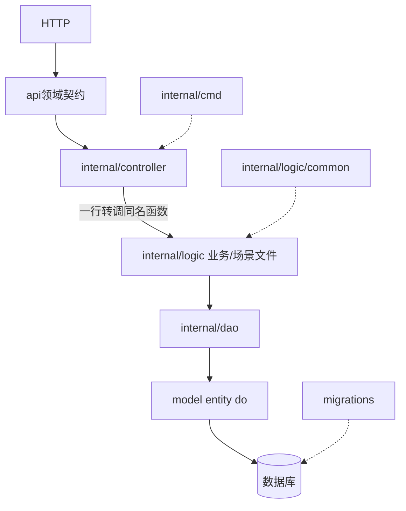

# 03 后端分层

与 `agent/AGENTS-后端.md` 脚手架一致。

```mermaid
flowchart TB
  HTTP[HTTP] --> API[api领域契约]
  API --> Ctrl[internal/controller]
  Ctrl -->|"一行转调同名函数"| Logic[internal/logic 业务/场景文件]
  Common[internal/logic/common] -.-> Logic
  Logic --> DAO[internal/dao]
  DAO --> Ent[model entity do]
  Ent --> DB[(数据库)]
  Cmd[internal/cmd] -.-> Ctrl
  Mig[migrations] -.-> DB
```

应用根：`{{BE_ROOT}}`  
禁令：controller 不写 SQL；logic 外禁止平行业务规则；计算只调源头。  
{{BE_NOTES}}
