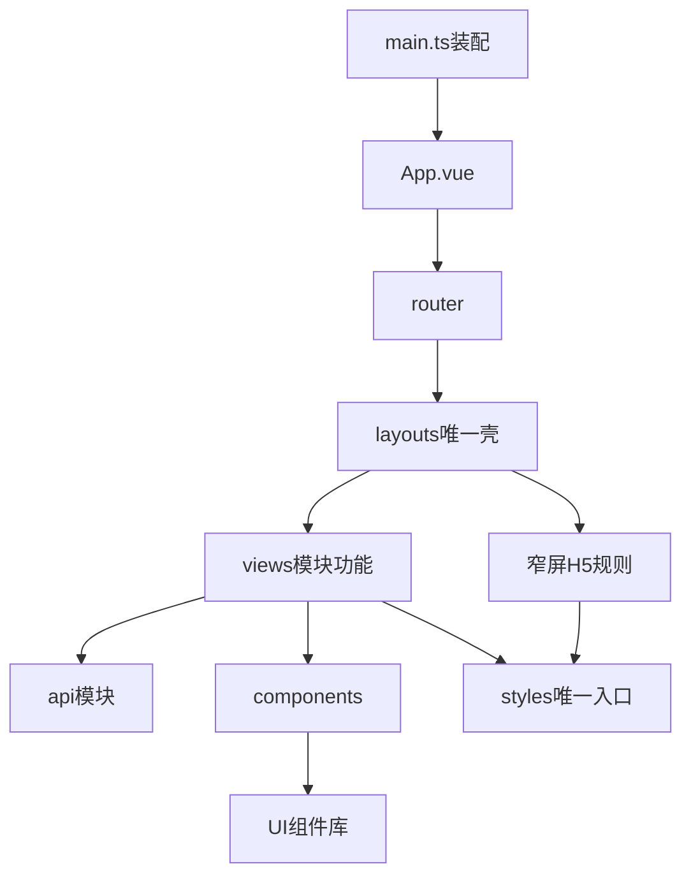

# 04 前端壳与脚手架

与 `agent/AGENTS-前端.md` 脚手架一致；含 PC 壳与手机 H5。

```mermaid
flowchart TB
  Main[main.ts装配] --> App[App.vue]
  App --> Router[router]
  Router --> Layout[layouts唯一壳]
  Layout --> Views[views模块功能]
  Views --> Api[api模块]
  Views --> Comp[components]
  Views --> Styles[styles唯一入口]
  Comp --> UI[UI组件库]
  Layout --> H5[窄屏H5规则]
  H5 --> Styles
```

应用根：`{{FE_ROOT}}`  
样式入口：`{{STYLE_ENTRY}}`  
弹窗/抽屉：`{{DIALOG_CLASSES}}`  
窄屏：唯一 H5 壳 + 窄屏 css；宽表横滑。详见 frontend-ui.md。  
{{FE_NOTES}}
