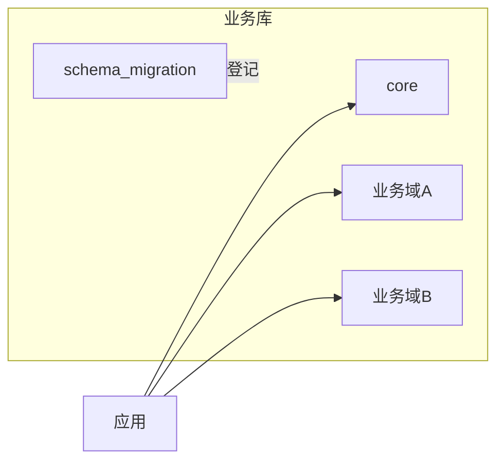

# 05 数据域

```mermaid
flowchart LR
  subgraph db [业务库]
    Core[core]
    DomA[业务域A]
    DomB[业务域B]
    Mig[schema_migration]
  end
  App[应用] --> Core
  App --> DomA
  App --> DomB
  Mig -.->|迁移登记| db
```

生成后换成真实 schema 名（可多个域节点）。  
`public`：{{PUBLIC_POLICY}}  
单据落表 / ID：{{DATA_ID_POLICY}}
