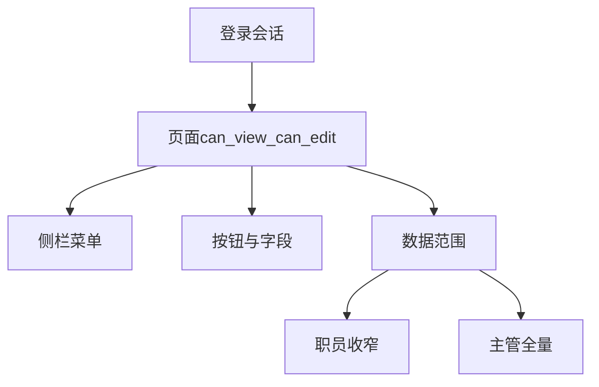

# 06 权限与数据范围

```mermaid
flowchart TB
  Login[登录会话] --> PagePerm[页面can_view_can_edit]
  PagePerm --> Menu[侧栏菜单]
  PagePerm --> Buttons[按钮与字段]
  PagePerm --> Scope[数据范围]
  Scope --> Staff[职员收窄]
  Scope --> Lead[主管全量]
```

匹配键：{{SCOPE_KEY}}  
双闸：前端不展示 + 后端写接口拒绝。  
{{AUTHZ_NOTES}}
