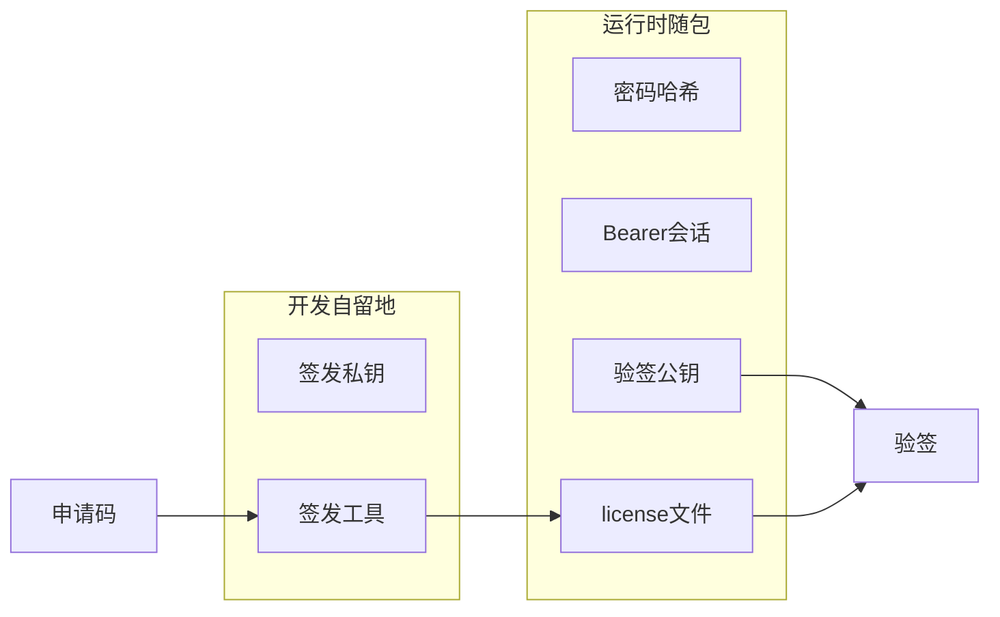

# 07 授权与密钥边界

```mermaid
flowchart LR
  subgraph runtime [运行时随包]
    Login[密码哈希]
    Session[Bearer会话]
    PubKey[验签公钥]
    Lic[license文件]
  end
  subgraph adminOnly [开发自留地]
    Priv[签发私钥]
    Gen[签发工具]
  end
  Apply[申请码] --> Gen
  Gen --> Lic
  PubKey --> Verify[验签]
  Lic --> Verify
```

算法摘要：{{CRYPTO_SUMMARY}}
