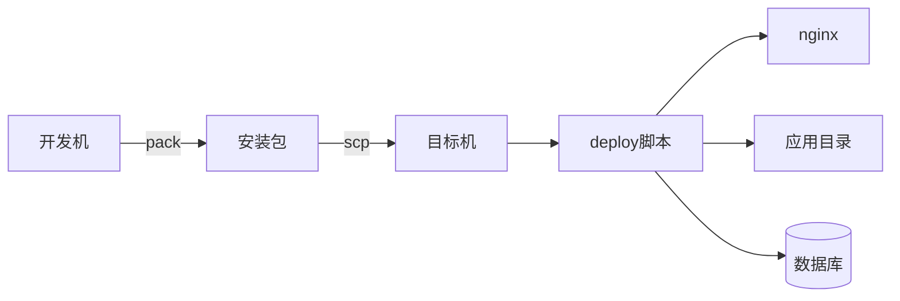

# 08 打包部署

```mermaid
flowchart LR
  Dev[开发机] -->|pack| Artifact[安装包]
  Artifact -->|scp| Target[目标机]
  Target --> Deploy[deploy脚本]
  Deploy --> Nginx[nginx]
  Deploy --> App[应用目录]
  Deploy --> DB[(数据库)]
```

版本对齐：{{VERSION_PIN}}  
config：{{CONFIG_MERGE_POLICY}}  
回滚：{{ROLLBACK}}
