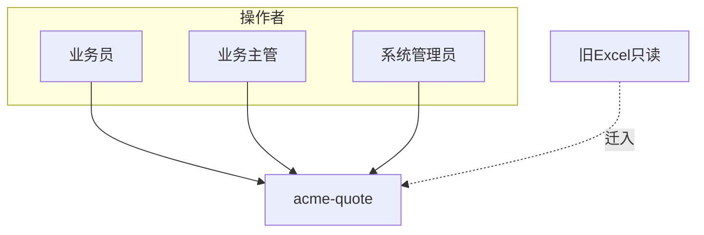

# 01 系统上下文

```mermaid
flowchart TB
  subgraph actors [操作者]
    Sales[业务员]
    Lead[业务主管]
    AdminUser[系统管理员]
  end
  System[acme-quote]
  Legacy[旧Excel只读]
  Sales --> System
  Lead --> System
  AdminUser --> System
  Legacy -.->|"迁入"| System
```
