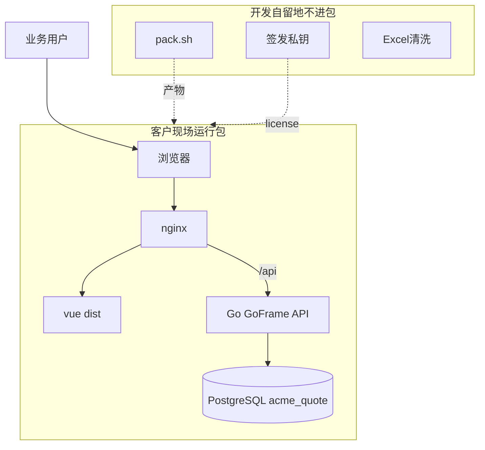

# 02 容器

```mermaid
flowchart TB
  subgraph runtime [客户现场运行包]
    Browser[浏览器]
    Nginx[nginx]
    Web[vue dist]
    API[Go GoFrame API]
    PG[(PostgreSQL acme_quote)]
    Browser --> Nginx
    Nginx --> Web
    Nginx -->|"/api"| API
    API --> PG
  end
  subgraph adminZone [开发自留地不进包]
    Pack[pack.sh]
    CaKey[签发私钥]
    ETL[Excel清洗]
  end
  User[业务用户] --> Browser
  Pack -.->|"产物"| runtime
  CaKey -.->|"license"| runtime
```
