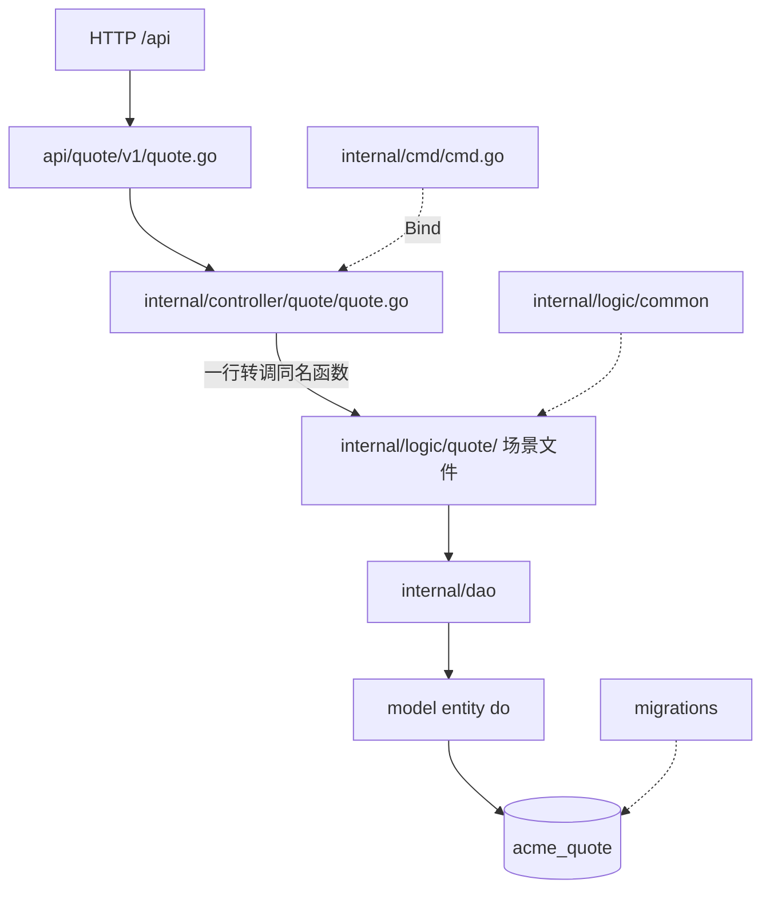

# 03 后端分层

与 `agent/AGENTS-后端.md` 脚手架一致。

```mermaid
flowchart TB
  HTTP[HTTP /api] --> API["api/quote/v1/quote.go"]
  API --> Ctrl["internal/controller/quote/quote.go"]
  Ctrl -->|"一行转调同名函数"| Logic["internal/logic/quote/ 场景文件"]
  Common[internal/logic/common] -.-> Logic
  Logic --> DAO[internal/dao]
  DAO --> Ent[model entity do]
  Ent --> DB[(acme_quote)]
  Cmd[internal/cmd/cmd.go] -.->|Bind| Ctrl
  Mig[migrations] -.-> DB
```

应用根：`server/`  
禁令：controller 不写 SQL；不设 service 层；logic 外禁止平行业务规则；计算只调源头。  
当前只有脚手架自带的 `demo`、`health`；报价业务（`quote`）落地后本图从「骨架」推到「与现状一致」。
