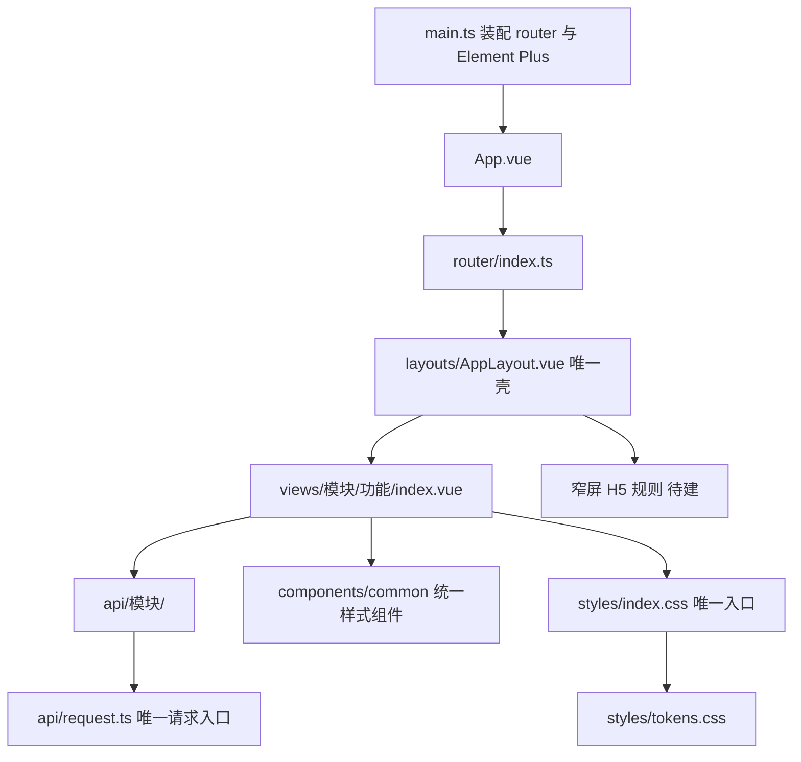

# 04 前端壳与脚手架

与 `agent/AGENTS-前端.md` 脚手架一致；含 PC 壳与手机 H5。

```mermaid
flowchart TB
  Main[main.ts 装配 router 与 Element Plus] --> App[App.vue]
  App --> Router[router/index.ts]
  Router --> Layout[layouts/AppLayout.vue 唯一壳]
  Layout --> Views["views/模块/功能/index.vue"]
  Views --> Api["api/模块/"]
  Api --> Req[api/request.ts 唯一请求入口]
  Views --> Common[components/common 统一样式组件]
  Views --> Styles[styles/index.css 唯一入口]
  Styles --> Tokens[styles/tokens.css]
  Layout --> H5[窄屏 H5 规则 待建]
```

应用根：`vue/`  
样式入口：`vue/src/styles/index.css`  
弹窗/抽屉：首个弹窗时建 `styles/dialog.css`（三类）。
