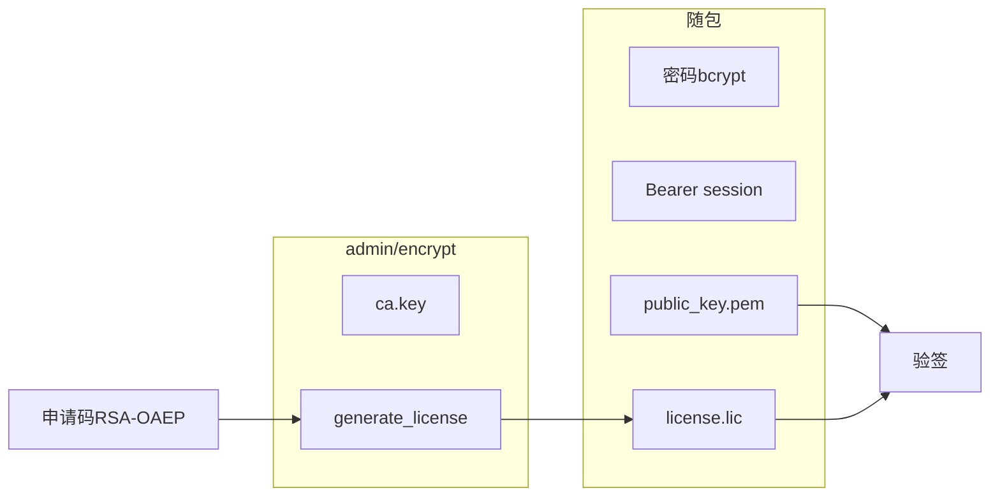

# 07 授权

```mermaid
flowchart LR
  subgraph runtime [随包]
    Bcrypt[密码bcrypt]
    Sess[Bearer session]
    Pub[public_key.pem]
    Lic[license.lic]
  end
  subgraph adminOnly [admin/encrypt]
    Priv[ca.key]
    Gen[generate_license]
  end
  Apply[申请码RSA-OAEP] --> Gen
  Gen --> Lic
  Pub --> Verify[验签]
  Lic --> Verify
```
