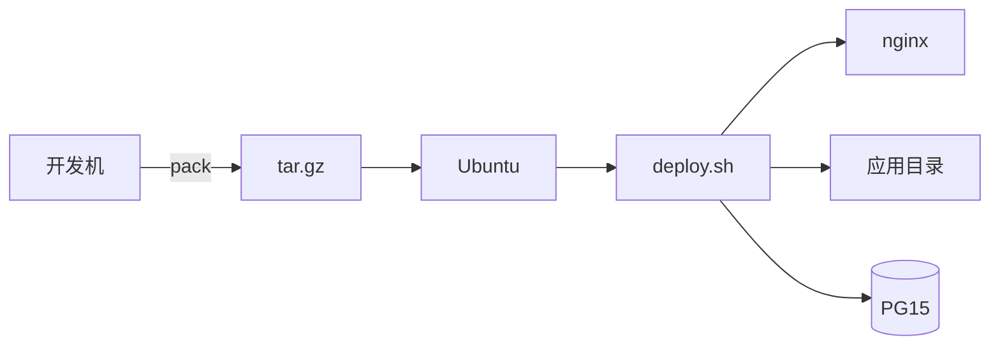

# 08 部署

```mermaid
flowchart LR
  Dev[开发机] -->|"pack"| Art[tar.gz]
  Art --> Target[Ubuntu]
  Target --> Deploy[deploy.sh]
  Deploy --> Nginx[nginx]
  Deploy --> App[应用目录]
  Deploy --> PG[(PG15)]
```

config 保留且按 example 深合并。
